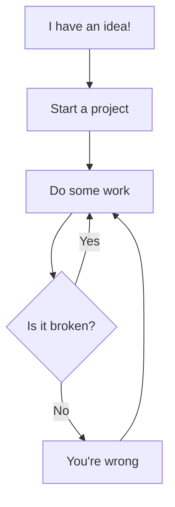

You can make diagrams with mermaid

<!--more-->

You can use the mermaid code fence to display inline mermaid diagrams.

## I have all sorts of ideas!

```mermaid
graph TD
    A[I have an idea!] --> B[Start a project] --> C[Do some work]
    C --> D{Is it broken?}
    D --> |Yes| C
    D --> |No| F[You're wrong]  --> C
```
